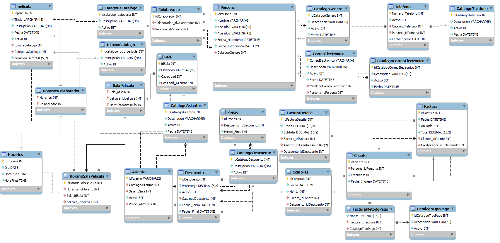

# Proyecto Final: Sistema de Gestión de Cine 🎬

Este proyecto implementa el modelado y la estructura de base de datos para un sistema de gestión de cines (`pCine`). Incluye scripts de creación, poblado de datos y una herramienta en Python para generar automáticamente la documentación del diccionario de datos.

## 🚀 Funcionalidades del Sistema
El esquema de base de datos (`schema.sql`) soporta las siguientes operaciones:
- **Gestión de Películas**: Catálogo, idiomas, géneros.
- **Salas y Asientos**: Control de capacidad y distribución.
- **Facturación**: Manejo de compras, clientes frecuentes y descuentos.
- **Recursos Humanos**: Gestión de colaboradores y horarios.

## 🛠 Tecnologías Utilizadas


## 📂 Contenido del Repositorio
- `schema.sql`: Script DDL para crear la base de datos `pCine`.
- `seeds.sql`: Datos de prueba para poblar las tablas.
- `proyecto.mwb`: Modelo entidad-relación en MySQL Workbench.
- `diccionario_gui.py`: Herramienta gráfica para exportar la estructura de tablas a imágenes PNG.

## 🔧 Herramienta de Documentación (Python)
El script `diccionario_gui.py` es una utilidad desarrollada con **Tkinter**, **SQLAlchemy** y **Matplotlib**.

### Uso:
1. Ejecutar el script:
   ```bash
   python diccionario_gui.py
   ```
2. Ingresar credenciales de base de datos (Usuario, Contraseña, Nombre BD).
3. Seleccionar carpeta de destino.
4. Generar imágenes con la estructura de cada tabla.

## 📊 Diagrama Relacional

