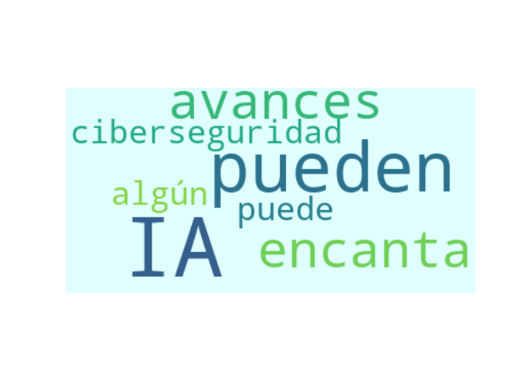
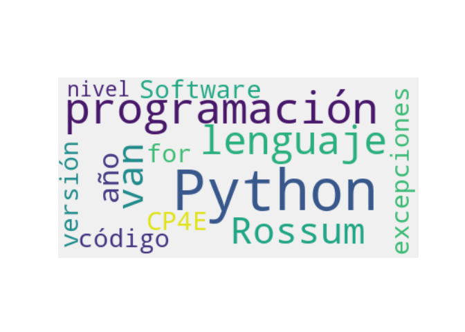
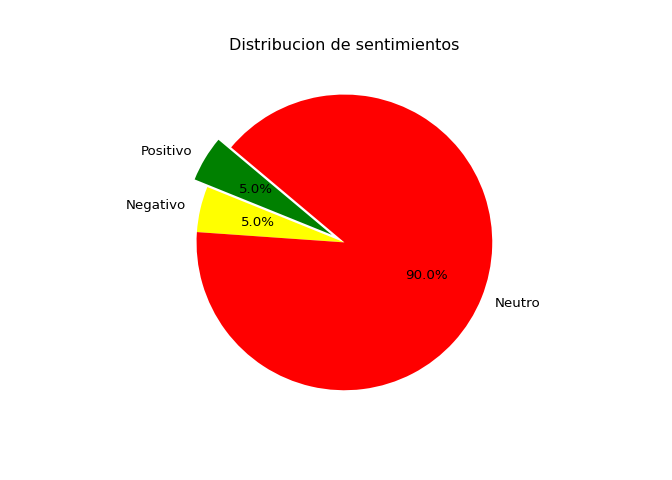

# Estudiante de Ingeniería de Software

# en la Universidad Internacional de las Américas Costa Rica.

<!--START_SECTION:badges-->

<!--END_SECTION:badges-->
## Base de datos 2 - RStudio

    import pandas as pd
    import matplotlib.pyplot as plt
    import nltk
    from nltk.corpus import stopwords
    from nltk.sentiment.vader import SentimentIntensityAnalyzer
    from wordcloud import WordCloud, ImageColorGenerator 
    import wikipedia
    import numpy as np

    #Lectura del archivo con los comentarios negativos

    df = pd.read_csv("reviewsfake.csv", delimiter=",")

    #nltk.download()

    #Muestra la informacion

    df.info ()

    ## <class 'pandas.core.frame.DataFrame'>
    ## RangeIndex: 20 entries, 0 to 19
    ## Data columns (total 3 columns):
    ##  #   Column    Non-Null Count  Dtype 
    ## ---  ------    --------------  ----- 
    ##  0   id        20 non-null     int64 
    ##  1   user      20 non-null     object
    ##  2   category  20 non-null     object
    ## dtypes: int64(1), object(2)
    ## memory usage: 612.0+ bytes

    df["category"]

    ## 0     Los avances en IA están revolucionando la form...
    ## 1     Me encanta explorar nuevas aplicaciones de IA ...
    ## 2     ¿Alguien ha probado alguna aplicación de IA pa...
    ## 3     Aunque mi pasión es la comida, no puedo evitar...
    ## 4     Trabajando en un proyecto de IA para predecir ...
    ## 5     ¿Se están utilizando algoritmos de IA para cre...
    ## 6     ¡La IA es el futuro! Estoy emocionado por ver ...
    ## 7     Incluso en el mundo de la gastronomía, la IA e...
    ## 8     Desarrollando un nuevo algoritmo de IA para me...
    ## 9     ¿Se pueden utilizar redes neuronales para mejo...
    ## 10    La IA es como la magia moderna, ¡me encanta su...
    ## 11    Curioso por saber si la IA puede ayudar a desc...
    ## 12    La ciberseguridad y la IA van de la mano en la...
    ## 13    ¿Se puede utilizar IA para optimizar la produc...
    ## 14    Explorando el papel de la IA en el diseño de i...
    ## 15    ¿Existe algún sistema de IA que pueda recomend...
    ## 16    La IA es el motor detrás de la próxima ola de ...
    ## 17    Interesado en cómo la IA puede contribuir a la...
    ## 18    ¿Cuál es el último avance en algoritmos de IA ...
    ## 19    ¿Se pueden utilizar algoritmos de IA para pers...
    ## Name: category, dtype: object

    #WordCloud
    stop_words_sp = set(stopwords.words('spanish'))
    stop_words_sp

    ## {'fuimos', 'sintiendo', 'es', 'habiendo', 'erais', 'estaba', 'unos', 'qué', 'esta', 'fueron', 'tenía', 'estéis', 'estuviese', 'también', 'todos', 'tendrás', 'e', 'quienes', 'tienen', 'habrías', 'habría', 'fuesen', 'sus', 'hubo', 'tuvieran', 'hubiésemos', 'estuvo', 'está', 'seríais', 'tengas', 'estamos', 'para', 'se', 'otros', 'él', 'fueses', 'habida', 'estaría', 'hubierais', 'tenga', 'hayamos', 'tendrán', 'tendremos', 'siente', 'suyo', 'durante', 'vosotros', 'será', 'estáis', 'estaréis', 'nuestros', 'estaré', 'antes', 'habidas', 'serían', 'sentidos', 'estaban', 'tuve', 'mis', 'tenían', 'tendrá', 'estén', 'sois', 'estuviésemos', 'sobre', 'fuese', 'hubiéramos', 'tienes', 'nada', 'habrás', 'vuestra', 'tenido', 'tendrías', 'más', 'estaríais', 'estando', 'seríamos', 'fueras', 'estarían', 'habrán', 'ha', 'con', 'o', 'habidos', 'tuyos', 'estad', 'cual', 'del', 'tengamos', 'hubieron', 'hayan', 'sea', 'estás', 'hubiese', 'estuvieron', 'habré', 'ese', 'cuando', 'hubieseis', 'estaremos', 'entre', 'un', 'habían', 'hube', 'algunos', 'seáis', 'eres', 'estuvimos', 'estés', 'sentida', 'tuvisteis', 'mi', 'haya', 'nuestra', 'tuyo', 'tenidos', 'sería', 'ellos', 'nos', 'habías', 'una', 'hubiera', 'fuiste', 'habíais', 'todo', 'nosotros', 'sí', 'tuya', 'le', 'tenida', 'hubiste', 'míos', 'serán', 'mucho', 'nuestras', 'estuviesen', 'estado', 'hubieran', 'estabas', 'tuviera', 'tuviese', 'fuerais', 'y', 'la', 'han', 'su', 'de', 'tendríais', 'quien', 'hubieses', 'tuyas', 'tuviéramos', 'tened', 'estuve', 'estábamos', 'tengáis', 'otra', 'como', 'habíamos', 'el', 'tendríamos', 'tanto', 'tu', 'habréis', 'tuvieseis', 'seamos', 'fuisteis', 'he', 'esa', 'vuestros', 'seréis', 'tus', 'estará', 'tenías', 'algunas', 'otras', 'estarías', 'fuéramos', 'estemos', 'ti', 'tenidas', 'vuestro', 'teniendo', 'hasta', 'hayas', 'te', 'ellas', 'estabais', 'era', 'soy', 'lo', 'fue', 'estuvieras', 'habéis', 'a', 'eras', 'nuestro', 'desde', 'donde', 'hay', 'teníais', 'serás', 'estarás', 'tuvieras', 'no', 'ella', 'fuera', 'esos', 'estuviera', 'fui', 'fueran', 'habríamos', 'fuésemos', 'tuvierais', 'las', 'fueseis', 'teníamos', 'tuvieses', 'estuviéramos', 'sentido', 'estaríamos', 'tiene', 'porque', 'hemos', 'tendré', 'este', 'esté', 'has', 'mía', 'suyos', 'hubimos', 'tuvieron', 'hayáis', 'tengo', 'habrá', 'mí', 'hubisteis', 'esas', 'esto', 'somos', 'estuvieseis', 'tenemos', 'yo', 'contra', 'mío', 'tendría', 'suyas', 'habrían', 'había', 'habríais', 'estar', 'vuestras', 'hubiesen', 'sin', 'suya', 'seré', 'habremos', 'os', 'tuviesen', 'estuvieses', 'tendréis', 'otro', 'tengan', 'tenéis', 'sentid', 'hubieras', 'muchos', 'estada', 'sean', 'ante', 'les', 'sentidas', 'estos', 'estuvierais', 'tuviste', 'tú', 'los', 'estoy', 'en', 'muy', 'poco', 'seremos', 'estados', 'nosotras', 'vosotras', 'estas', 'ni', 'ya', 'estuvisteis', 'seas', 'uno', 'éramos', 'estuviste', 'algo', 'tendrían', 'tuvimos', 'están', 'estuvieran', 'eran', 'tuvo', 'habido', 'serías', 'al', 'eso', 'mías', 'tuviésemos', 'por', 'pero', 'estadas', 'son', 'me', 'estarán', 'que'}

    text = " ".join(cat.split()[1] for cat in df.category)
    text

    ## 'avances encanta ha mi en están IA en un pueden IA por ciberseguridad puede el algún IA en es pueden'

    word_cloud = WordCloud(collocations = False, background_color = 'lightcyan', stopwords=stop_words_sp, max_words=20).generate(text)
     
    print(word_cloud)

    ## <wordcloud.wordcloud.WordCloud object at 0x0000023485DAA650>

    #Grafico

    plt.imshow(word_cloud, interpolation='bilinear')
    plt.axis("off")

    ## (np.float64(-0.5), np.float64(399.5), np.float64(199.5), np.float64(-0.5))

    (-0.5, 399.5, 199.5, -0.5)

    ## (-0.5, 399.5, 199.5, -0.5)

    plt.show()

    wikipedia.set_lang("es")
    text= wikipedia.summary("Python (programming language)",sentences=100000)
    print(text)

    ## Python es un lenguaje de alto nivel de programación interpretado cuya filosofía hace hincapié en la legibilidad de su código. Se trata de un lenguaje de programación multiparadigma, ya que soporta parcialmente la orientación a objetos, programación imperativa y, en menor medida, programación funcional. Es un lenguaje interpretado, dinámico y multiplataforma.
    ## Administrado por Python Software Foundation, posee una licencia de código abierto, denominada Python Software Foundation License.​ Python se clasifica constantemente como uno de los lenguajes de programación más populares, siendo ya en 2025 el más popular y además con una amplia diferencia récord histórico de más de 15 puntos porcentuales sobre el siguiente.​
    ## 
    ## 
    ## == Historia ==
    ## 
    ## Python fue creado a finales de los años ochenta por Guido van Rossum en Stichting Mathematisch Centrum (CWI),​ en Países Bajos, como un sucesor del lenguaje de programación ABC, capaz de manejar excepciones e interactuar con el sistema operativo Amoeba.​
    ## El nombre del lenguaje proviene de la afición de su creador por los humoristas británicos Monty Python.​
    ## Guido van Rossum es el principal autor de Python, y su continuo rol central en decidir la dirección de Python es reconocido, refiriéndose a él como Benevolente Dictador Vitalicio (en inglés: Benevolent Dictator for Life, BDFL); sin embargo el 12 de julio de 2018 declinó de dicha situación de honor sin dejar un sucesor o sucesora y con una declaración altisonante:​
    ## 
    ##  
    ## 
    ## El 20 de febrero de 1991, van Rossum publicó el código por primera vez en alt.sources, con el número de versión 0.9.0.​ En esta etapa del desarrollo ya estaban presentes clases con herencia, manejo de excepciones, funciones y los tipos modulares, como: str, list, dict, entre otros. Además en este lanzamiento inicial aparecía un sistema de módulos adoptado de Modula-3; van Rossum describe el módulo como «una de las mayores unidades de programación de Python».​ El modelo de excepciones en Python es parecido al de Modula-3, con la adición de una cláusula else.​ En el año 1994 se formó comp.lang.python, el foro de discusión principal de Python, marcando un hito en el crecimiento del grupo de usuarios de este lenguaje.
    ## Python alcanzó la versión 1.0 en enero de 1994. Una característica de este lanzamiento fueron las herramientas de la programación funcional: lambda, reduce, filter y map.​ Van Rossum explicó que «hace 12 años, Python adquirió lambda, reduce(), filter() y map(), cortesía de Amrit Perm, un hacker informático de Lisp que las implementó porque las extrañaba».​
    ## La última versión liberada proveniente de CWI fue Python 1.2. En 1995, van Rossum continuó su trabajo en Python en la Corporation for National Research Initiatives (CNRI) en Reston, Virginia, donde lanzó varias versiones del software.
    ## Durante su estancia en CNRI, van Rossum lanzó la iniciativa Computer Programming for Everybody (CP4E), con el fin de hacer la programación más accesible a más gente, con un nivel de 'alfabetización' básico en lenguajes de programación, similar a la alfabetización básica en inglés y habilidades matemáticas necesarias por muchos trabajadores. Python tuvo un papel crucial en este proceso: debido a su orientación hacia una sintaxis limpia, ya era idóneo, y las metas de CP4E presentaban similitudes con su predecesor, ABC. El proyecto fue patrocinado por DARPA.​ Para el año 2007, el proyecto CP4E se encontraba inactivo;​ a pesar de ello, Python continúa intentando ser fácil de aprender y no muy arcano en su sintaxis y semántica, con el objetivo de ser entendible incluso para no-programadores.

    tokens = nltk.word_tokenize(text)
    print(tokens)

    ## ['Python', 'es', 'un', 'lenguaje', 'de', 'alto', 'nivel', 'de', 'programación', 'interpretado', 'cuya', 'filosofía', 'hace', 'hincapié', 'en', 'la', 'legibilidad', 'de', 'su', 'código', '.', 'Se', 'trata', 'de', 'un', 'lenguaje', 'de', 'programación', 'multiparadigma', ',', 'ya', 'que', 'soporta', 'parcialmente', 'la', 'orientación', 'a', 'objetos', ',', 'programación', 'imperativa', 'y', ',', 'en', 'menor', 'medida', ',', 'programación', 'funcional', '.', 'Es', 'un', 'lenguaje', 'interpretado', ',', 'dinámico', 'y', 'multiplataforma', '.', 'Administrado', 'por', 'Python', 'Software', 'Foundation', ',', 'posee', 'una', 'licencia', 'de', 'código', 'abierto', ',', 'denominada', 'Python', 'Software', 'Foundation', 'License.\u200b', 'Python', 'se', 'clasifica', 'constantemente', 'como', 'uno', 'de', 'los', 'lenguajes', 'de', 'programación', 'más', 'populares', ',', 'siendo', 'ya', 'en', '2025', 'el', 'más', 'popular', 'y', 'además', 'con', 'una', 'amplia', 'diferencia', 'récord', 'histórico', 'de', 'más', 'de', '15', 'puntos', 'porcentuales', 'sobre', 'el', 'siguiente.\u200b', '==', 'Historia', '==', 'Python', 'fue', 'creado', 'a', 'finales', 'de', 'los', 'años', 'ochenta', 'por', 'Guido', 'van', 'Rossum', 'en', 'Stichting', 'Mathematisch', 'Centrum', '(', 'CWI', ')', ',', '\u200b', 'en', 'Países', 'Bajos', ',', 'como', 'un', 'sucesor', 'del', 'lenguaje', 'de', 'programación', 'ABC', ',', 'capaz', 'de', 'manejar', 'excepciones', 'e', 'interactuar', 'con', 'el', 'sistema', 'operativo', 'Amoeba.\u200b', 'El', 'nombre', 'del', 'lenguaje', 'proviene', 'de', 'la', 'afición', 'de', 'su', 'creador', 'por', 'los', 'humoristas', 'británicos', 'Monty', 'Python.\u200b', 'Guido', 'van', 'Rossum', 'es', 'el', 'principal', 'autor', 'de', 'Python', ',', 'y', 'su', 'continuo', 'rol', 'central', 'en', 'decidir', 'la', 'dirección', 'de', 'Python', 'es', 'reconocido', ',', 'refiriéndose', 'a', 'él', 'como', 'Benevolente', 'Dictador', 'Vitalicio', '(', 'en', 'inglés', ':', 'Benevolent', 'Dictator', 'for', 'Life', ',', 'BDFL', ')', ';', 'sin', 'embargo', 'el', '12', 'de', 'julio', 'de', '2018', 'declinó', 'de', 'dicha', 'situación', 'de', 'honor', 'sin', 'dejar', 'un', 'sucesor', 'o', 'sucesora', 'y', 'con', 'una', 'declaración', 'altisonante', ':', '\u200b', 'El', '20', 'de', 'febrero', 'de', '1991', ',', 'van', 'Rossum', 'publicó', 'el', 'código', 'por', 'primera', 'vez', 'en', 'alt.sources', ',', 'con', 'el', 'número', 'de', 'versión', '0.9.0.\u200b', 'En', 'esta', 'etapa', 'del', 'desarrollo', 'ya', 'estaban', 'presentes', 'clases', 'con', 'herencia', ',', 'manejo', 'de', 'excepciones', ',', 'funciones', 'y', 'los', 'tipos', 'modulares', ',', 'como', ':', 'str', ',', 'list', ',', 'dict', ',', 'entre', 'otros', '.', 'Además', 'en', 'este', 'lanzamiento', 'inicial', 'aparecía', 'un', 'sistema', 'de', 'módulos', 'adoptado', 'de', 'Modula-3', ';', 'van', 'Rossum', 'describe', 'el', 'módulo', 'como', '«', 'una', 'de', 'las', 'mayores', 'unidades', 'de', 'programación', 'de', 'Python', '»', '.\u200b', 'El', 'modelo', 'de', 'excepciones', 'en', 'Python', 'es', 'parecido', 'al', 'de', 'Modula-3', ',', 'con', 'la', 'adición', 'de', 'una', 'cláusula', 'else.\u200b', 'En', 'el', 'año', '1994', 'se', 'formó', 'comp.lang.python', ',', 'el', 'foro', 'de', 'discusión', 'principal', 'de', 'Python', ',', 'marcando', 'un', 'hito', 'en', 'el', 'crecimiento', 'del', 'grupo', 'de', 'usuarios', 'de', 'este', 'lenguaje', '.', 'Python', 'alcanzó', 'la', 'versión', '1.0', 'en', 'enero', 'de', '1994', '.', 'Una', 'característica', 'de', 'este', 'lanzamiento', 'fueron', 'las', 'herramientas', 'de', 'la', 'programación', 'funcional', ':', 'lambda', ',', 'reduce', ',', 'filter', 'y', 'map.\u200b', 'Van', 'Rossum', 'explicó', 'que', '«', 'hace', '12', 'años', ',', 'Python', 'adquirió', 'lambda', ',', 'reduce', '(', ')', ',', 'filter', '(', ')', 'y', 'map', '(', ')', ',', 'cortesía', 'de', 'Amrit', 'Perm', ',', 'un', 'hacker', 'informático', 'de', 'Lisp', 'que', 'las', 'implementó', 'porque', 'las', 'extrañaba', '»', '.\u200b', 'La', 'última', 'versión', 'liberada', 'proveniente', 'de', 'CWI', 'fue', 'Python', '1.2', '.', 'En', '1995', ',', 'van', 'Rossum', 'continuó', 'su', 'trabajo', 'en', 'Python', 'en', 'la', 'Corporation', 'for', 'National', 'Research', 'Initiatives', '(', 'CNRI', ')', 'en', 'Reston', ',', 'Virginia', ',', 'donde', 'lanzó', 'varias', 'versiones', 'del', 'software', '.', 'Durante', 'su', 'estancia', 'en', 'CNRI', ',', 'van', 'Rossum', 'lanzó', 'la', 'iniciativa', 'Computer', 'Programming', 'for', 'Everybody', '(', 'CP4E', ')', ',', 'con', 'el', 'fin', 'de', 'hacer', 'la', 'programación', 'más', 'accesible', 'a', 'más', 'gente', ',', 'con', 'un', 'nivel', 'de', "'alfabetización", "'", 'básico', 'en', 'lenguajes', 'de', 'programación', ',', 'similar', 'a', 'la', 'alfabetización', 'básica', 'en', 'inglés', 'y', 'habilidades', 'matemáticas', 'necesarias', 'por', 'muchos', 'trabajadores', '.', 'Python', 'tuvo', 'un', 'papel', 'crucial', 'en', 'este', 'proceso', ':', 'debido', 'a', 'su', 'orientación', 'hacia', 'una', 'sintaxis', 'limpia', ',', 'ya', 'era', 'idóneo', ',', 'y', 'las', 'metas', 'de', 'CP4E', 'presentaban', 'similitudes', 'con', 'su', 'predecesor', ',', 'ABC', '.', 'El', 'proyecto', 'fue', 'patrocinado', 'por', 'DARPA.\u200b', 'Para', 'el', 'año', '2007', ',', 'el', 'proyecto', 'CP4E', 'se', 'encontraba', 'inactivo', ';', '\u200b', 'a', 'pesar', 'de', 'ello', ',', 'Python', 'continúa', 'intentando', 'ser', 'fácil', 'de', 'aprender', 'y', 'no', 'muy', 'arcano', 'en', 'su', 'sintaxis', 'y', 'semántica', ',', 'con', 'el', 'objetivo', 'de', 'ser', 'entendible', 'incluso', 'para', 'no-programadores', '.']

    #WORD CLOUD WIKI
    word_cloud = WordCloud(collocations = False, background_color = '#F0F0F0', stopwords=stop_words_sp, max_words=13).generate(text)
    print(word_cloud)

    ## <wordcloud.wordcloud.WordCloud object at 0x0000023485E6B0D0>

    plt.imshow(word_cloud, interpolation='bilinear')
    plt.axis("off")

    ## (np.float64(-0.5), np.float64(399.5), np.float64(199.5), np.float64(-0.5))

    (-0.5, 399.5, 199.5, -0.5)

    ## (-0.5, 399.5, 199.5, -0.5)

    plt.show()

    # Analsiis de sentimientos
    modelo = SentimentIntensityAnalyzer()
    sentimientos = np.array([])
    for x in df["category"]:
      try:
        sentimiento = modelo.polarity_scores(x)['compound']
        if sentimiento > 0.1:
          sentimientos = np.append(sentimientos,"positivo")
        elif sentimiento < -0.1:
          sentimientos = np.append(sentimientos,"negativo")
        else:
          sentimientos = np.append(sentimientos,"neutro")
      except:
        sentimientos = np.append(sentimientos,"no aplica")
    positivos = len(sentimientos[sentimientos == "positivo"])
    negativos = len(sentimientos[sentimientos == "negativo"])
    neutros = len(sentimientos[sentimientos == "neutro"])
    y = [positivos,negativos,neutros]
    labels = ["Positivo","Negativo","Neutro"]
    colors = ["green","yellow", "red"]
    y

    ## [1, 1, 18]

    labels

    ## ['Positivo', 'Negativo', 'Neutro']

    plt.pie(y,labels = labels, colors = colors,explode = (0.1,0,0),autopct = '%1.1f%%', startangle = 140)

    ## ([<matplotlib.patches.Wedge object at 0x0000023485F07E50>, <matplotlib.patches.Wedge object at 0x000002348600FC90>, <matplotlib.patches.Wedge object at 0x0000023486012650>], [Text(-1.0286007932889554, 0.6180456358921498, 'Positivo'), Text(-1.0718071159153977, 0.24744596637067523, 'Negativo'), Text(1.0199024222871251, -0.41206680163882997, 'Neutro')], [Text(-0.6000171294185572, 0.36052662093708737, '5.0%'), Text(-0.5846220632265805, 0.13497052711127738, '5.0%'), Text(0.5563104121566136, -0.22476370998481632, '90.0%')])

    plt.axis = ('equal')
    plt.title('Distribucion de sentimientos')
    plt.show()

