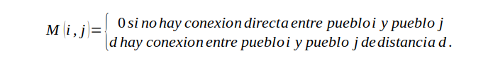

# Laboratorio 2

    Una región esta formada por n pueblos dispersos. 
    Hay conexiones directas entre algunos de ellos, y entre otros no existe conexión, aunque puede haber un camino. 
    Escribir una aplicación que tenga como entrada la matriz que representa las conexiones directas entre pueblos, 
    de tal forma que el elemento M(i, j) de la matriz sea:

    Tenga también como entrada un par de pueblos (x, y). 
    La aplicación tiene que encontrar un camino entre ambos pueblos utilizando técnicas recursivas. 
    La salida ha de ser la ruta que ha de seguir para ir de x a y junto a la distancia de la ruta.
