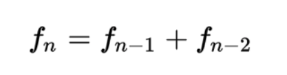
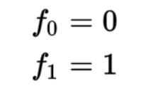

# Estudiante de Ingeniería de Software
# en la Universidad Internacional de las Américas Costa Rica.

<!--START_SECTION:badges-->

<!--END_SECTION:badges-->

## Estrucuturas de datos y Algoritmos - Java

### Laboratorios:
#### Laboratorio 6  [archivos](https://github.com/bash20cu/Universidad/tree/main/Estructuras_de_Datos_Algoritmos/Laboratorio_6)
#### Vive tu música
    Usted ha ganado una licitación para la programación de un nuevo proyecto en una empresa de telecomunicaciones denominado: “Vive tu música”. Específicamente se le solicita que programe la funcionalidad de listas de reproducción.

    El arquitecto de la organización ha definido los siguientes lineamientos que usted debe respetar en el desarrollo de la funcionalidad:
    • La lista de reproducción debe ser una lista simplemente enlazada, que contenga los siguientes datos:
        ◦ Número de nodo
        ◦ Nombre de la canción
        ◦ Nombre del cantante
        ◦ Número interno de procesamiento

    • El cálculo del número interno de procesamiento corresponde al valor de la serie Fibonnacci para el número de nodo correspondiente y el número de nodo es el consecutivo interno cada vez que se agrega un nodo.

    Por lo tanto, usted debe:
        i. Implementar el TAD de una lista simplemente enlazada (valor 5 puntos)
        ii. Implementar las operaciones para insertar y borrar en la lista (valor 15 puntos)
        iii. Implementar un algoritmo recursivo para encontrar el número interno de procesamiento (valor 30 puntos)

    Como apoyo a los requerimientos anteriores, el analista de sistemas le brinda la siguiente información:
    
    ¿Cómo calcular el número interno de procesamiento?
        
        El número interno de procesamiento es el valor de la serie Fibonnacci que corresponde al número de nodo.
        El número de nodo es el consecutivo con el cual se ingresa el nodo, es decir, como todos los nodos se ingresan
         de último se verifica el último número de nodo y se le suma uno y se agrega. 
        Así en una lista el primer nodo ingresado tendría el número de nodo 1, el siguiente el número 2, 
         el siguiente el nodo 3 y así sucesivamente.

    El número interno de procesamiento se calcula con la siguiente fórmula:

    Y tiene dos casos con valores predeterminados

    Esto quiere decir que si el nodo con número de nodo 2, tendría un número interno de procesamiento de 1, si el número de nodo es 3 el número interno de procesamiento es 2 y así sucesivamente.