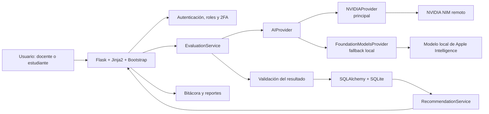
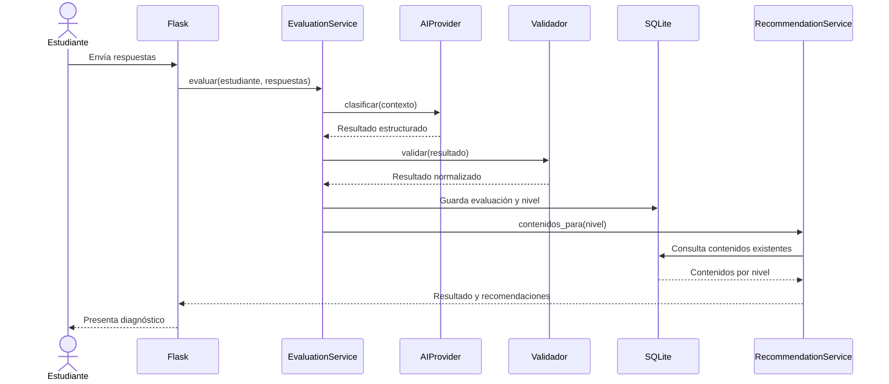

# Minuta técnica: NVIDIA + Foundation Models para TutorIA

**Proyecto:** TutorIA, tutor inteligente adaptativo mediante inteligencia artificial local  
**Equipo:** Equipo 1  
**Curso:** Herramientas para el Desarrollo de Sistemas de Información  
**Fecha de discusión:** 10 de junio de 2026; actualización 5 de agosto de 2026  
**Estado:** Decisión adoptada para el MVP

## 1. Propósito de la discusión

El diseño inicial de TutorIA contemplaba Ollama como motor local. Para el MVP se
adopta una combinación más directa con NVIDIA NIM como proveedor principal y
Foundation Models como respaldo local en macOS. Ollama queda como alternativa
futura, no como parte del flujo activo de esta entrega.

La decisión debe preservar el alcance del MVP:

- Aplicación web desarrollada con Python, Flask, Jinja2 y Bootstrap 5.
- Gestión de usuarios, roles, estudiantes y contenidos.
- Autenticación con contraseña y segundo factor TOTP mediante una aplicación autenticadora.
- Evaluación diagnóstica y clasificación en nivel básico, intermedio o avanzado.
- Recomendación de contenidos según el nivel obtenido.
- Bitácora de transacciones y reportes básicos.
- Procesamiento de IA privado y preferiblemente local.

No se propone migrar la aplicación a Swift ni ampliar sus funciones.

## 2. Capacidades de IA requeridas

TutorIA no necesita un asistente general ni un agente autónomo. El motor de IA
debe resolver tareas delimitadas y verificables:

1. Recibir las respuestas de una evaluación diagnóstica.
2. Aplicar instrucciones y criterios pedagógicos definidos por el equipo.
3. Devolver una clasificación estructurada.
4. Explicar brevemente la clasificación.
5. Identificar fortalezas y oportunidades de mejora.
6. Sugerir temas o competencias; la aplicación seleccionará los contenidos
   existentes en la base de datos.

La IA no debe crear usuarios, modificar calificaciones directamente ni decidir
qué información persiste. Esas responsabilidades pertenecen a los servicios de
negocio de Flask.

## 3. Alternativas evaluadas

### 3.1. Apple Foundation Models

Foundation Models permite utilizar desde Python el modelo integrado en Apple
Intelligence. El SDK oficial ofrece inferencia en el dispositivo, streaming,
tool calling y generación guiada de respuestas estructuradas.

El repositorio oficial del SDK Python indica estos requisitos:

- macOS 26 o posterior.
- Xcode 26 o posterior y aceptación de su licencia.
- Python 3.10 o posterior.
- Mac compatible con Apple Intelligence y Apple Intelligence activado.

Debe diferenciarse la base disponible desde macOS 26 de las novedades de
WWDC26. El comando `fm`, el modelo renovado y varias capacidades anunciadas para
la nueva generación corresponden a macOS 27. Para el MVP no se deben prometer
esas funciones mientras no se confirme el sistema operativo de la computadora
de demostración.

### 3.2. NVIDIA NIM

NVIDIA NIM expone una API compatible con OpenAI y se utiliza como proveedor
remoto configurable mediante `NVIDIA_API_KEY`, `NVIDIA_MODEL` y
`NVIDIA_BASE_URL`. Permite que el mismo MVP funcione en Windows y macOS cuando
existe conectividad y una credencial válida.

Su uso requiere controlar conectividad, credenciales, privacidad y límites del
servicio. Las claves no se guardan en el repositorio ni en las evidencias.

## 4. Comparación para el MVP

| Criterio | Foundation Models | NVIDIA NIM |
|---|---|---|
| Integración con Python | Cliente HTTP hacia `fm serve` | API HTTP compatible con OpenAI |
| Procesamiento local | Sí, con Foundation Models | No; servicio remoto |
| Salida estructurada | Prompt JSON y validación propia | Respuesta JSON y validación propia |
| Instalación del modelo | Administrada por el sistema | Administrada por NVIDIA NIM |
| API key | No | Sí, por variable de entorno |
| Plataformas | Mac compatible con Apple Intelligence | macOS, Windows y Linux |
| Control del modelo | Limitado al modelo y políticas del sistema | Modelo configurable mediante entorno |
| Consumo de recursos | Gestionado por macOS | Depende del servicio remoto |
| Riesgo principal | Dependencia de hardware, sistema y disponibilidad | Conectividad, credencial y disponibilidad remota |
| Ajuste al MVP | Fallback local y privacidad en macOS | Proveedor principal multiplataforma |

**Conclusión comparativa:** NVIDIA NIM facilita una demostración multiplataforma
como proveedor principal, mientras Foundation Models aporta un fallback local
en macOS sin API key. La abstracción común permite cambiar esta decisión sin
reescribir el dominio de TutorIA.

## 5. Arquitectura propuesta

La decisión es usar NVIDIA NIM como proveedor principal y Foundation Models como
proveedor de contingencia local. La aplicación no invoca ninguno directamente
desde las rutas Flask.



### Responsabilidades

- **Rutas Flask:** reciben solicitudes, aplican autorización y presentan vistas.
- **`EvaluationService`:** prepara el contexto pedagógico, solicita la
  clasificación y controla el flujo de negocio.
- **`AIProvider`:** contrato independiente de NVIDIA y Foundation Models.
- **Proveedores:** traducen el contrato común a cada SDK o API.
- **Validador:** rechaza respuestas incompletas o niveles fuera del catálogo.
- **SQLAlchemy:** persiste respuestas, resultado validado, proveedor utilizado y
  estado de la evaluación.
- **`RecommendationService`:** consulta contenidos registrados según el nivel;
  no permite que el modelo invente identificadores de contenido.
- **Bitácora:** registra la evaluación, proveedor, éxito, fallback y errores sin
  almacenar contraseñas, códigos 2FA ni datos sensibles innecesarios.

## 6. Flujo de evaluación



## 7. Contrato común del proveedor

La interfaz conceptual será independiente del SDK:

```python
class AIProvider:
    def is_available(self) -> tuple[bool, str | None]:
        ...

    async def classify(self, request: DiagnosticRequest) -> DiagnosticResult:
        ...
```

El resultado compartido tendrá esta forma:

```json
{
  "nivel": "basico | intermedio | avanzado",
  "explicacion": "Justificación breve basada en las respuestas",
  "fortalezas": ["..."],
  "oportunidades_mejora": ["..."],
  "temas_recomendados": ["..."],
  "confianza": 0.0
}
```

Reglas de validación:

- `nivel` debe pertenecer al catálogo cerrado.
- Las listas pueden estar vacías, pero nunca ser nulas.
- La explicación tendrá una longitud máxima definida por la aplicación.
- `confianza` será informativa y estará limitada entre `0` y `1`; no sustituye
  una medición estadística de precisión.
- Los contenidos mostrados al estudiante se resolverán contra la base de datos.
- Una respuesta inválida no se guardará como clasificación definitiva.

## 8. Disponibilidad y fallback

Orden propuesto:

1. Comprobar NVIDIA cuando está configurado como proveedor principal.
2. Si NVIDIA está disponible, utilizar `NVIDIAProvider`.
3. Si NVIDIA no está disponible o falla, comprobar Foundation Models y utilizar
   `FoundationModelsProvider`.
4. Si ambos fallan, conservar las respuestas como evaluación pendiente,
   informar al usuario y registrar un evento técnico.
5. No asignar un nivel ficticio ni ocultar el error.

El proveedor empleado quedará registrado para reproducir las pruebas. El
fallback no debe ocurrir silenciosamente en modo de desarrollo.

## 9. Privacidad y Private Cloud Compute

Foundation Models se considera procesamiento local en el dispositivo. NVIDIA
NIM se considera procesamiento remoto y la interfaz debe mostrar esa diferencia
mediante `processing_location` y `access_mode`.

Private Cloud Compute es un servicio remoto de Apple con garantías específicas
de privacidad. No debe describirse como procesamiento local ni formar parte del
flujo principal del MVP. Podría mencionarse como evolución futura, sujeta a
conectividad, disponibilidad, límites y aprobación académica.

## 10. Impacto en el stack y la documentación

La implementación aprobada contiene:

- `NVIDIAProvider` como proveedor principal.
- `FoundationModelsProvider` como fallback local.
- `FallbackChatProvider` fuera de las rutas Flask.
- Documentar los requisitos de Mac, macOS, Xcode y Apple Intelligence.
- Mantener el contrato común y los metadatos de proveedor.

Ollama queda fuera del MVP y podrá evaluarse como proveedor futuro.

Hasta recibir aprobación, no se modificarán el planner, el informe ni el stack
oficial del proyecto.

## 11. Riesgos y mitigaciones

| Riesgo | Efecto | Mitigación |
|---|---|---|
| Mac incompatible o Apple Intelligence desactivado | FM no está disponible | Verificación previa y fallback a NVIDIA |
| Uso de una capacidad exclusiva de macOS 27 | Demo no reproducible en macOS 26 | Limitar el MVP a funciones confirmadas y registrar versiones |
| NVIDIA no responde | Falla el proveedor principal | Verificar clave, conectividad y usar Foundation Models en macOS |
| Respuesta no válida | Nivel incorrecto o error de persistencia | Esquema cerrado, validación y reintento controlado |
| Resultados diferentes entre proveedores | Difícil reproducibilidad | Casos diagnósticos fijos y registro del proveedor |
| Confusión entre IA local y PCC | Incumplimiento del objetivo | Excluir PCC del flujo principal y explicarlo con precisión |
| Ampliación del alcance | Retraso del MVP | Implementar solo clasificación y apoyo a recomendaciones |

## 12. Propuesta para aprobación

Se recomienda aprobar la siguiente decisión:

> TutorIA mantendrá su aplicación web en Python y Flask. La integración de IA
> se realizará mediante una interfaz propia denominada `AIProvider`.
> NVIDIA NIM será el proveedor principal y Foundation Models será el proveedor
> de respaldo local en una Mac compatible. La lógica de evaluación, validación,
> persistencia y recomendación permanecerá independiente del proveedor.

Esta solución aprovecha la integración directa de Apple sin perder la
posibilidad de ejecutar el proyecto en otro entorno. También permite defender
una arquitectura modular, probar proveedores con el mismo contrato y controlar
el riesgo de disponibilidad.

## 13. Preguntas para el profesor

1. ¿Se acepta que la demostración principal del MVP requiera una Mac compatible
   con Apple Intelligence?
2. ¿Foundation Models en el dispositivo cumple la condición de “IA local” del
   proyecto?
3. ¿Ollama debe demostrarse funcionando o basta implementarlo y documentarlo
   como respaldo?
4. ¿La portabilidad a Windows o Linux forma parte de los criterios de
   evaluación?
5. ¿Se autoriza actualizar el stack oficial y el riesgo técnico del planner
   después de validar un prototipo?
6. ¿Se acepta que Private Cloud Compute quede fuera del MVP por no ser
   procesamiento local?
7. ¿Qué evidencia espera el profesor para comparar ambos proveedores: tiempos,
   exactitud sobre casos fijos, capturas o registros de ejecución?

## 14. Criterios para tomar la decisión

Antes de actualizar la documentación oficial, el equipo deberá confirmar:

- Disponibilidad real de Foundation Models en la Mac de desarrollo.
- Ejecución desde el mismo entorno Python utilizado por Flask.
- Generación y validación del contrato `DiagnosticResult`.
- Tiempo de respuesta aceptable con un conjunto fijo de evaluaciones.
- Funcionamiento del fallback a Ollama.
- Capacidad de repetir la demostración sin conexión a internet.

## 15. Referencias oficiales

Apple. (2026). *Build AI-powered scripts with the fm CLI and Python SDK*
[Video]. Apple Developer.
https://developer.apple.com/videos/play/wwdc2026/334/

Apple. (2026). *Foundation Models SDK for Python*. GitHub.
https://github.com/apple/python-apple-fm-sdk

Apple. (2026). *What’s new in the Foundation Models framework* [Video].
Apple Developer. https://developer.apple.com/videos/play/wwdc2026/241/

Apple. (s. f.). *Foundation Models*. Apple Developer Documentation.
https://developer.apple.com/documentation/foundationmodels

Ollama. (s. f.). *Introduction: API reference*.
https://docs.ollama.com/api/introduction

Ollama. (s. f.). *Quickstart*. https://docs.ollama.com/quickstart

Ollama. (s. f.). *Structured outputs*.
https://docs.ollama.com/capabilities/structured-outputs
