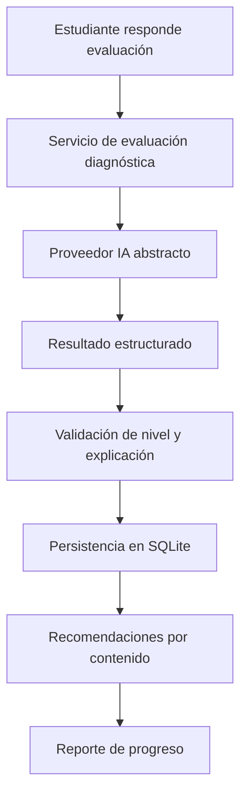

# Arquitectura De TutorIA

## Visión General

TutorIA es una aplicación web local para apoyar evaluaciones diagnósticas, clasificación de nivel y recomendación de contenidos educativos mediante inteligencia artificial. El MVP utiliza Flask como aplicación central, SQLite como base de datos de desarrollo y un proveedor de IA abstracto que actualmente puede conectarse con Foundation Models.

## Principios Arquitectónicos

- Separar rutas, servicios, modelos, formularios y vistas.
- Mantener la lógica educativa fuera de los templates.
- Usar proveedores de IA intercambiables.
- Registrar acciones importantes en bitácora.
- Mantener un MVP simple, demostrable y defendible en tres meses.
- Documentar decisiones relevantes para facilitar la defensa académica.

## Módulos Principales

| Módulo | Ubicación | Responsabilidad |
|---|---|---|
| Autenticación | `app/routes/auth.py`, `app/services/two_factor.py` | Login, segundo factor, sesiones y cierre de sesión. |
| Usuarios y roles | `app/models/User` | Administrador, docente y estudiante. |
| Estudiantes | `app/routes/students.py`, `app/models/Student` | Registro, edición, consulta y eliminación controlada. |
| Contenidos | `app/models/EducationalContent` | Catálogo de recursos por tema, nivel y competencia. |
| Evaluación diagnóstica | `app/models/DiagnosticEvaluation`, `DiagnosticAnswer` | Registro de respuestas y resultado de clasificación. |
| IA | `ai_provider.py`, `fm_server.py`, `app/services/chat.py` | Abstracción, estado, streaming y proveedor Foundation Models. |
| TOTP 2FA | `app/services/two_factor.py` | Generación de secretos, QR y validación de códigos mediante una aplicación autenticadora. |
| Bitácora | `app/services/audit.py`, `app/models/AuditLog` | Registro de eventos importantes. |
| Interfaz | `app/templates`, `app/static` | Pantallas Jinja2 con Bootstrap local. |

## Flujo De Autenticación Y 2FA

1. El usuario ingresa usuario y contraseña.
2. Flask valida credenciales contra el hash almacenado.
3. Se genera código de seis dígitos.
4. Se guarda solamente el hash del código.
5. El código expira en diez minutos y permite máximo tres intentos.
6. El envío se realiza por consola en desarrollo o Resend en modo real.
7. Al validar el código, se inicia sesión con Flask-Login.
8. Se registra el evento en bitácora.

## Flujo De IA

1. La vista o servicio solicita estado del proveedor IA.
2. Flask usa una abstracción común y no llama directamente al SDK o comando concreto.
3. `FoundationModelsProvider` despierta `fm serve` si la aplicación es responsable de administrarlo.
4. La respuesta se transmite por Server-Sent Events para la pantalla de chat.
5. Para diagnóstico, el siguiente paso será pedir una salida estructurada y validarla antes de persistir.

## Arquitectura Del Flujo Académico

## Base De Datos Actual

| Tabla | Estado | Uso |
|---|---|---|
| `users` | Implementada | Usuarios, roles y credenciales. |
| `two_factor_codes` | Implementada | Códigos 2FA hasheados. |
| `audit_logs` | Implementada | Bitácora de acciones. |
| `students` | Implementada | Perfiles de estudiantes. |
| `educational_contents` | Modelo, seed y CRUD | Biblioteca clasificada por tema, nivel y competencia. |
| `diagnostic_questions` | Modelo, seed y formulario | Preguntas activas para diagnóstico. |
| `diagnostic_evaluations` | Modelo y flujo | Guarda estado, nivel y explicación de IA. |
| `diagnostic_answers` | Modelo y flujo | Conserva respuestas asociadas a cada pregunta. |
| `content_recommendations` | Modelo y servicio | Relaciona estudiante, evaluación y contenido sugerido. |
| `audit_logs` | Modelo y servicio | Trazabilidad de operaciones importantes. |

## Despliegue Local

- El MVP se ejecuta con `./run.sh`.
- El puerto por defecto es `5050`.
- Bootstrap está versionado localmente.
- SQLite se crea en `instance/tutoria.db`.
- Foundation Models se administra mediante `fm serve` cuando está disponible.

## Decisiones Pendientes

- Confirmar prueba real de Foundation Models antes de documentarlo como completado.
- Confirmar prueba real de Resend antes de documentarlo como completado.
- Preparar UML, evidencias y el informe final.
