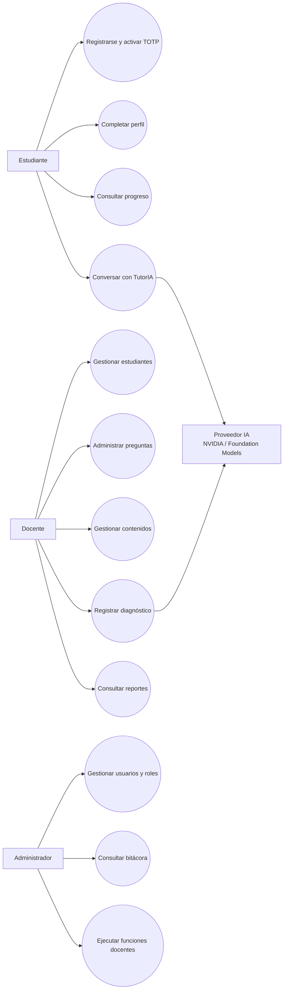
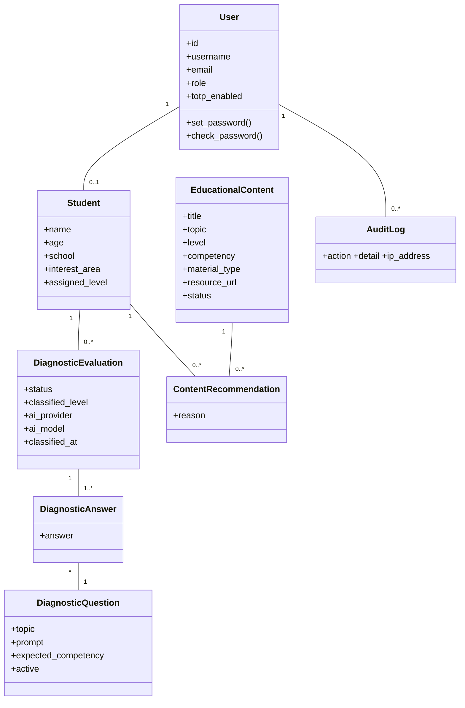
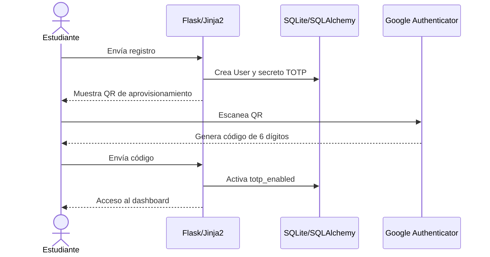
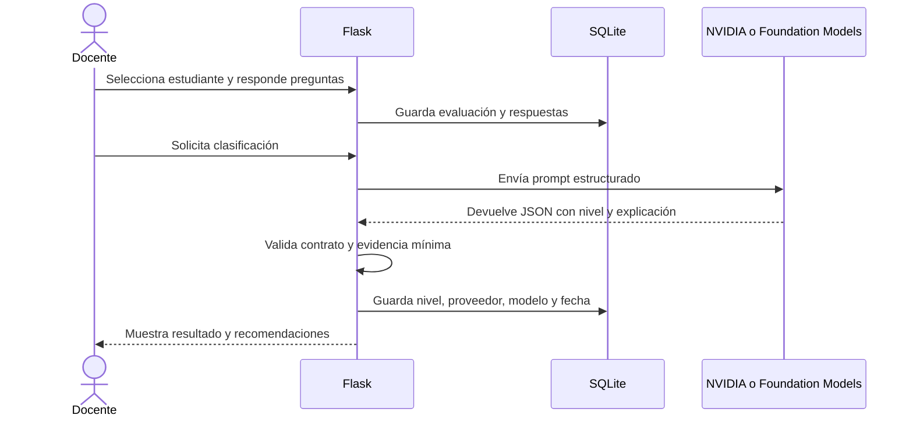

# UML de TutorIA

Documento de apoyo para el informe académico. Los diagramas están expresados en
Mermaid para poder versionarlos junto con el código y exportarlos a imagen o PDF.

## Diagrama de casos de uso

## Diagrama de clases simplificado

## Diagrama de secuencia: registro y TOTP

## Diagrama de secuencia: diagnóstico con IA

