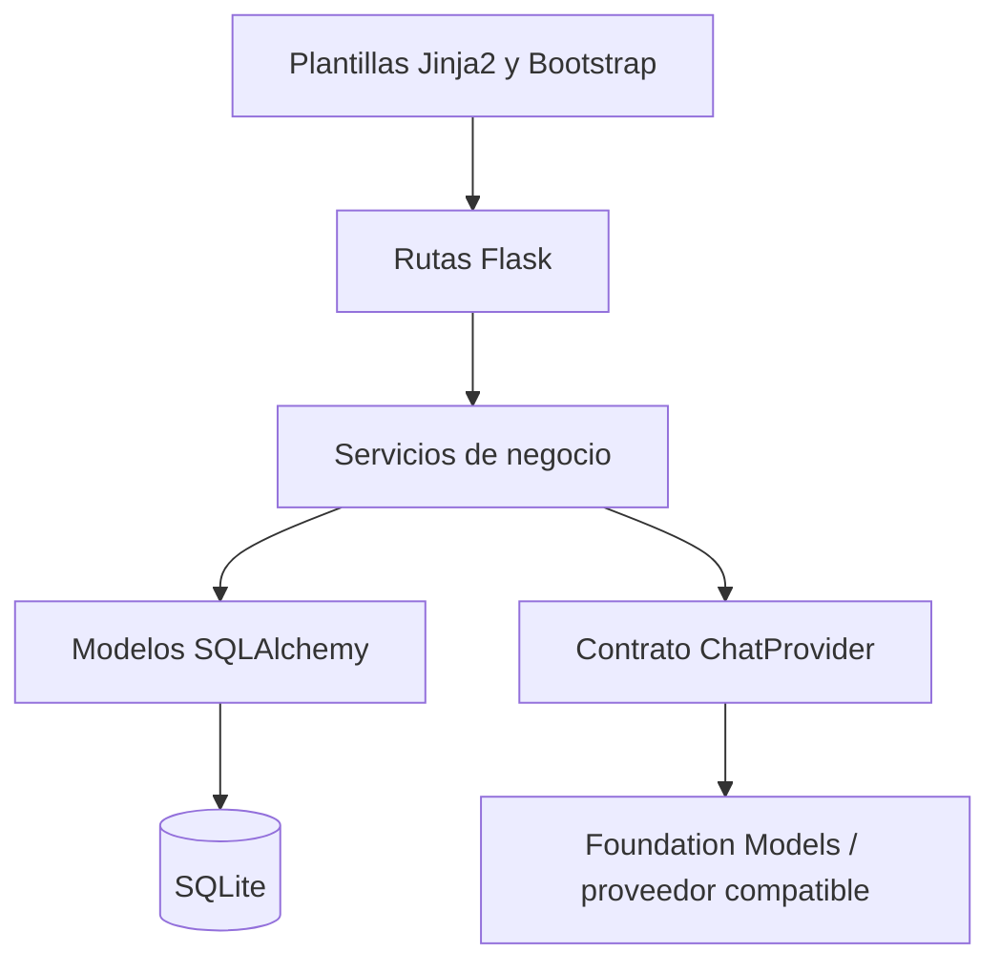

# Arquitectura y explicación de TutorIA MVP

## 1. Propósito

TutorIA es un sistema web académico para acompañar el aprendizaje. El docente registra estudiantes, aplica una evaluación diagnóstica y solicita una clasificación de nivel. Con ese resultado, el sistema presenta una ruta de contenidos explicable y un reporte de progreso.

El proyecto se mantiene como MVP: no incluye pagos, LMS completo, aplicación móvil ni analítica avanzada.

## 2. Capas del programa



- `app/templates` y `app/static`: interfaz, estilos y JavaScript de apoyo.
- `app/routes`: recibe solicitudes HTTP, valida permisos y coordina servicios.
- `app/services`: concentra reglas de negocio, auditoría, IA, 2FA y recomendaciones.
- `app/models`: representa datos persistentes y sus relaciones.
- `app/forms`: valida entradas y protege formularios con CSRF.
- `ai_provider.py`: define el contrato, el cliente NVIDIA NIM y el fallback a Foundation Models.
- `runtime_manager.py`: administra procesos locales, puertos, salud y apagado seguro.
- `desktop_launcher.py`: interfaz PySide6 para operar la demo en macOS.

## 2.1 Proveedores de IA

La aplicación intenta usar NVIDIA NIM cuando `AI_PRIMARY_PROVIDER=nvidia` y hay
`NVIDIA_API_KEY`. La llamada se realiza contra el endpoint compatible con OpenAI
de NVIDIA. Si la clave no existe o NVIDIA devuelve un error,
`FallbackChatProvider` activa Foundation Models y conserva el flujo de chat y
diagnóstico sin cambiar las rutas ni las vistas.

Las claves no forman parte del repositorio. Se cargan desde `.env`, que está
ignorado por Git, y `.env.example` solo contiene marcadores.

## 3.1 Centro de control de escritorio

El panel PySide6 se mantiene separado de Flask porque resuelve una necesidad
operativa distinta: controlar el entorno local de demostración. `RuntimeManager`
es propietario de los procesos que inicia, conserva sus PID, captura sus logs y
los termina mediante su grupo de procesos. Si encuentra un `fm serve` existente,
solo lo adopta cuando `ps` confirma que el proceso corresponde al comando de
Foundation Models en el puerto esperado.

La ventana presenta:

- estado de Foundation Models y Flask;
- PID, puertos y URL local;
- botones para encender, apagar, abrir TutorIA y revisar logs;
- tarjeta de código 2FA visible únicamente en modo de desarrollo por consola;
- limpieza automática al cerrar con la X o `Cmd+Q`.

## 4. Módulos principales

| Módulo | Responsabilidad |
|---|---|
| Autenticación | Contraseña, sesión, 2FA, cierre de sesión y eventos de auditoría. |
| Usuarios | Administración de cuentas y roles por parte del administrador. |
| Estudiantes | Perfil académico básico y nivel asignado. |
| Contenidos | Biblioteca clasificada por tema, nivel y competencia. |
| Diagnóstico | Preguntas, respuestas, clasificación IA y explicación. |
| Recomendaciones | Selección determinista de recursos según nivel y área de interés. |
| Reportes | Resumen general e historial individual del estudiante. |
| Chat | Conversación con un proveedor IA mediante Server-Sent Events. |
| Auditoría | Registro de acciones importantes con usuario, entidad, detalle e IP. |

## 5. Flujo académico

1. Un administrador o docente registra el perfil del estudiante.
2. El docente aplica las preguntas diagnósticas.
3. Se guardan las respuestas asociadas a preguntas y estudiante.
4. El proveedor IA recibe un prompt estructurado y debe devolver JSON validable.
5. El sistema valida el nivel `basico`, `intermedio` o `avanzado`. Si alguna respuesta no alcanza la evidencia mínima, el nivel no puede superar `basico`.
6. El nivel se guarda en la evaluación y en el perfil del estudiante.
7. El servicio de recomendaciones busca primero coincidencias de tema y nivel.
8. El reporte muestra evaluaciones, nivel y ruta sugerida.

## 6. Regla de recomendaciones

La recomendación no inventa materiales. Consulta contenidos registrados en la base de datos:

1. Busca recursos con el mismo nivel y cuyo tema coincida con el área de interés.
2. Completa hasta cinco recursos con contenidos del mismo nivel.
3. Guarda el motivo de cada recomendación para que el docente pueda explicarla.

Esta regla es intencionalmente sencilla y defendible para un proyecto académico. La IA clasifica; la selección de contenidos queda trazable y controlable.

## 7. Seguridad y validación

- Las contraseñas se almacenan con hash de Werkzeug.
- Los códigos 2FA se almacenan con hash, expiran en diez minutos, tienen tres intentos y son de un solo uso.
- Los formularios usan Flask-WTF y CSRF.
- Las rutas sensibles verifican autenticación y rol.
- El estudiante no puede administrar estudiantes, contenidos, diagnósticos ni reportes institucionales.
- Las entradas textuales tienen longitudes máximas y se normalizan antes de persistir.
- Las acciones relevantes se registran en `AuditLog`.

## 8. Datos principales

- `User`: credenciales, correo, rol y estado.
- `Student`: perfil académico y nivel actual.
- `EducationalContent`: material de aprendizaje.
- `DiagnosticQuestion`: pregunta activa y competencia esperada.
- `DiagnosticEvaluation`: resultado de una aplicación diagnóstica.
- `DiagnosticAnswer`: respuesta textual asociada a la evaluación.
- `ContentRecommendation`: relación entre estudiante, contenido y evaluación que originó la sugerencia.
- `AuditLog`: trazabilidad de operaciones.

## 9. Ejecución

```bash
cd /Volumes/projects/proyectos/UIA/Herramientas_desarrollo_software/mvp_minimo
./run.sh
```

Para usar el centro de control gráfico:

```bash
./Iniciar_TutorIA_Desktop.command
```

La aplicación usa `http://127.0.0.1:5050`. En desarrollo, el código 2FA aparece en consola. Foundation Models se administra mediante `fm serve` cuando el equipo es compatible.

## 10. Pruebas

La suite usa pytest y un proveedor simulado para no depender del modelo real durante las pruebas. Debe cubrir autenticación, permisos, CRUD, diagnóstico, clasificación, recomendaciones, reportes, auditoría y errores de validación.
