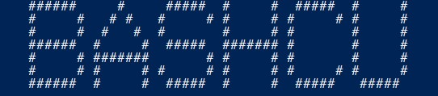

## Estudiante de Ingeniería de Software

¡Bienvenido a mi repositorio de la Universidad Internacional de las Américas en Costa Rica!

Soy un estudiante de Ingeniería de Software apasionado por la programación y el desarrollo de software. Aquí encontrarás una colección de ejercicios y proyectos que he completado durante mi tiempo en la universidad.

### Donar

**¿Cómo puedes apoyarme?**

Si los ejercicios y proyectos que he compartido te han sido útiles o inspiradores, considera apoyarme comprándome un café. Cualquier donación será muy apreciada y me ayudará a continuar mi educación y mi trabajo en el mundo de la programación.

- 
- 

## Powershell_Scripts

## Script de Control del Servicio de SQL Server

Este es un script PowerShell diseñado para controlar el servicio de SQL Server. Proporciona funcionalidades como detener, iniciar y reiniciar los servicios de SQL Server en un sistema. Además, presenta un elemento divertido: un dibujo ASCII personalizado.

  <!-- Reemplaza 'Imagen_URL' con la URL de la imagen del dibujo ASCII si lo deseas -->

## Funciones Principales

El script contiene las siguientes funciones principales:

### Show-MyNameAsciiArt

Esta función muestra un dibujo ASCII personalizado con tu nombre.

### Test-Administrator

Verifica si el usuario actual tiene acceso administrativo en el sistema.

### Get-ServiceStatus

Obtiene el estado de un servicio específico de SQL Server.

## Uso del Script

El script se puede utilizar para:

- Verificar si tienes acceso administrativo.
- Comprobar si el servicio de SQL Server existe en el sistema.
- Detener todos los servicios de SQL Server y sus dependencias.
- Iniciar todos los servicios de SQL Server.
- Reiniciar todos los servicios de SQL Server y sus dependencias.

## Notas Importantes

- Este script está diseñado para fines educativos y de demostración. Los ejercicios y proyectos son ejemplos creados por el autor y no representan trabajos reales de la universidad ni de otros estudiantes.

- Siempre ejecuta el script como administrador para realizar acciones que requieran privilegios elevados.

- Asegúrate de tener en cuenta los posibles efectos de detener, iniciar o reiniciar servicios de SQL Server en tu entorno antes de utilizar estas funciones en un entorno de producción.

## Cómo Ejecutar el Script

1. Abre una ventana de PowerShell.

2. Navega al directorio donde se encuentra el script.

3. Ejecuta el script utilizando el comando `.\mssql_service.ps1`.

4. Sigue las instrucciones proporcionadas por el script para controlar el servicio de SQL Server.

Espero que este script sea útil para tu propósito y que disfrutes del dibujo ASCII personalizado que muestra. ¡Diviértete programando!

## Script de Control del Servicio de MySQL

Este script PowerShell está diseñado para controlar el servicio de MySQL en tu sistema. Proporciona una funcionalidad de control básica que te permite verificar el estado del servicio y tomar acciones como detener, iniciar o reiniciar el servicio.

## Funciones Principales

El script incluye las siguientes funciones principales:

### Show-MyNameAsciiArt

Esta función muestra un dibujo ASCII personalizado que representa tu nombre.

### Test-Administrator

Verifica si el usuario actual tiene acceso administrativo en el sistema.

### Get-ServiceStatus

Obtiene el estado de un servicio específico de MySQL en el sistema.

## Uso del Script

Puedes utilizar este script para:

- Verificar si tienes acceso administrativo en tu sistema.
- Comprobar si el servicio de MySQL existe en tu sistema.
- Obtener el estado actual del servicio de MySQL.
- Apagar el servicio de MySQL.
- Iniciar el servicio de MySQL.
- Reiniciar el servicio de MySQL.

## Notas Importantes

- Este script está diseñado con fines educativos y de demostración, y es especialmente útil si deseas aprender sobre cómo controlar servicios de Windows mediante PowerShell.

- Asegúrate de ejecutar el script como administrador para realizar acciones que requieran privilegios elevados.

- Ten en cuenta que modificar el estado de un servicio de MySQL puede afectar el funcionamiento de las aplicaciones que dependen de él, así que úsalo con cuidado y en un entorno de prueba si es necesario.

## Cómo Ejecutar el Script

1. Abre una ventana de PowerShell.

2. Navega al directorio donde se encuentra el script.

3. Ejecuta el script utilizando el comando `.\mysql_service.ps1`.

4. Sigue las instrucciones proporcionadas por el script para controlar el servicio de MySQL.

Espero que este script sea útil para tus necesidades de administración del servicio de MySQL en tu sistema. ¡Disfruta del dibujo ASCII personalizado y aprende PowerShell al mismo tiempo!
