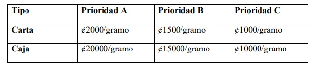

# Estudiante de Ingeniería de Software
# en la Universidad Internacional de las Américas Costa Rica.

<!--START_SECTION:badges-->

<!--END_SECTION:badges-->

## Programacion 1 - Java

### laboratorio 2
   Ejercicio #1

      Se requiere una aplicación que reciba el resultado de una prueba de 
      una lista desconocida de estudiantes, en esta lista junto a cada nombre hay un A
      escrito, si el estudiante aprobó el examen, o un B si lo reprobó. El programa debe 
      analizar los resultados del examen de la siguiente manera:
      a. Introducir cada resultado de la prueba (es decir, un A o un B). 
         Mostrar el mensaje “Ingrese el resultado del estudiante #” en la pantalla, 
         cada vez que el programa solicite otro resultado de la prueba.
      b. Si se ingresa un valor que no sea A o B, se debe mostrar el mensaje “Dato Invalido” 
         y volver a pedir la nota de ese estudiante, no puede avanzar si no se ingresa una nota válida.
      c. Después de ingresar una nota valida, debe preguntar si desea agregar una nueva o no.
      d. Llevar el número de resultados de la prueba, de cada tipo.
      e. Al finalizar el ingreso de notas, debe mostrar un resumen de los resultados de la prueba, 
         indicando el número de estudiantes, el número que aprobaron 
         y el número de estudiantes que reprobaron, 
         así como el porcentaje de estudiantes aprobados y reprobados.
      f. Al final debe preguntar si se desea ingresar otra lista de estudiantes, de ser 
      así se debe repetir todo el proceso anterior, de lo contrario se finaliza la aplicación.

      Ejercicio #2:
      Realizar un programa que permita realizar una encuesta para las 
      siguientes elecciones presidenciales en Costa Rica con los candidatos de los 
      partidos tradicionales (PTN. PUNS, PAD). A cada persona se le pregunta: El 
      programa debe tener un menú con las siguientes opciones:
      a. Aplicar encuesta: esta opción permite encuestar a una persona y 
         se deben registrar las respuestas a las siguientes preguntas:
            i. Si va a votar, En caso de que la respuesta sea afirmativa, 
               se le preguntará por qué partido Votará.
            ii. Debe llevar un control de la información recolectada en el punto anterior.
      b. Consultar datos: en esta opción consultara los resultados de la encuesta:
            i. ¿Cuál es el partido que está liderando la encuesta?
            ii. ¿Cuál es % a favor de cada partido, teniendo en cuenta, las personas que si votaran?
            iii. ¿Cuál es % de personas que no votarán?
            iv. ¿Cuál es el % de personas que SI votaran?
      c. Salir: finaliza aplicación

      Ejercicio #3: 
      Realice una aplicación donde que calcule el total a pagar por el envío de un paquete 
      según la siguiente tabla
      Por cada paquete calculado, se debe preguntar a usuario si sea agregar otro, de ser 
      afirmativo, se repite el proceso, de lo contrario se finaliza la aplicación.
