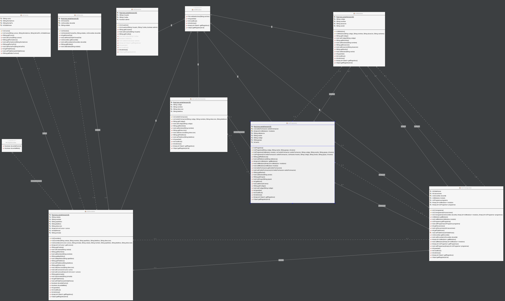

# Estudiante de Ingeniería de Software

# en la Universidad Internacional de las Américas Costa Rica.

<!--START_SECTION:badges-->

<!--END_SECTION:badges-->

## Programacion 1 - Java

### Proyecto Final

**UNIVERSIDAD INTERNACIONAL**

**DE LAS AMÉRICAS**

**ESCUELA DE INGENIERÍA INFORMÁTICA**

**PROYECTO**
#

**CURSO PROGRAMACION I**

**SANTIAGO CALDERÓN RUEDA**

**MIGUEL FERNÁNDEZ ARTEAGA**

**DANIEL GUERRERO FALLAS**

**ROLANDO SEQUEIRA VÍCTOR**

**SAN JOSÉ, COSTA RICA**

#
# **Índice**

Contenidos

[**Índice** 2](#_Toc121851629)

[**Prologo** 3](#_Toc121851630)

[**Requerimientos** 4](#_Toc121851631)

[**Requerimiento #1: Login** 4](#_Toc121851632)

[**Requerimiento #2: Control de roles** 4](#_Toc121851633)

[**Requerimiento #3: MDI:** 5](#_Toc121851634)

[**Requerimiento #4: Menú principal** 6](#_Toc121851635)

[**Requerimiento #5: Pantalla Usuarios** 7](#_Toc121851636)

[**Requerimiento #6: Pantalla docentes** 8](#_Toc121851637)

[**Requerimiento #7: Pantalla módulos** 9](#_Toc121851638)

[**Requerimiento #8: Pantalla programas** 9](#_Toc121851639)

[**Requerimiento #9: Pantalla cronograma** 10](#_Toc121851640)

[**Requerimiento #10: Almacenamiento** 11](#_Toc121851641)

[**Bibliografía** 12](#_Toc121851642)

#
# **Prologo**

A medida que hemos ido aprendiendo java, ha habido mucho interés entre los alumnos por profundizar en los conceptos de este lenguaje. En lugar de simplemente resolver problemas, también nos hemos centrado en comprender los principios e ideas subyacentes que nos permiten encontrar soluciones. Hemos aprendido sobre interfaces gráficas de usuario, sistemas de inicio de sesión, protocolos de seguridad y protocolos MDI.

También hemos aprendido cómo crear un menú principal funcional con interfaces fáciles de usar tanto para profesores como para estudiantes, lo que les permite agregar cursos y crear diagramas de horarios. Al final del proceso, podemos almacenar y administrar esta información de manera segura. Con eso dicho, nuestro enfoque ha sido obtener una comprensión profunda del lenguaje y sus capacidades, así como crear aplicaciones efectivas y fáciles de usar.

Java es un lenguaje de programación popular que se utiliza para crear una amplia gama de aplicaciones. Un ejemplo de un programa que podría crearse usando Java es un sistema para profesores y estudiantes. Este sistema podría permitir a los docentes agregar cursos y crear cronogramas (también conocidos como cronogramas), y también podría proporcionar a los estudiantes acceso a esta información. En términos de diseño, la interfaz de usuario de este programa debería ser fácil de usar e intuitiva, lo que permitiría a los profesores agregar cursos y crear horarios fácilmente, y permitir que los estudiantes accedan a esta información. Resumidamente, Java proporciona una plataforma poderosa y flexible para crear aplicaciones que pueden ayudar a los profesores y estudiantes a administrar y organizar sus horarios y cursos.

#
# **Requerimientos**

## **Requerimiento #1: Login**

Para este proyecto, decidimos crear una pantalla de inicio de sesión con una interfaz fácil de usar. El objetivo de nuestro diseño era facilitar a los usuarios el acceso a sus cuentas y navegar por el sistema.

Para lograr esto, nos enfocamos en crear un diseño limpio y simple que fuera intuitivo para que los usuarios interactuaran. Usamos un esquema de color mínimo, también incorporamos texto grande y fácil de leer.

Además del diseño visual, también nos enfocamos en crear un proceso de inicio de sesión fluido y eficiente. Implementamos un sistema de autenticación seguro para proteger la información personal de los usuarios y evitar el acceso no autorizado a sus cuentas.

(DeHacker, 2019)

Minuciosamente, nuestro objetivo era crear una pantalla de inicio de sesión que fuera visualmente atractiva y funcional, brindando a los usuarios una experiencia segura y sin inconvenientes. Creemos que nuestro diseño cumple con estos objetivos y estamos seguros de que será bien recibido por los usuarios.

## **Requerimiento #2: Control de roles**

Un control de funciones es una función de un sistema informático o una aplicación de software que permite a los administradores gestionar el acceso y los permisos de los usuarios. Se utiliza para determinar qué usuarios tienen acceso a características o funciones específicas dentro del sistema y para establecer el nivel de acceso que tiene cada usuario.

Los controles de roles son una parte esencial de cualquier sistema informático que utilizan varios usuarios, ya que ayudan a garantizar que los usuarios solo tengan acceso a las características y funciones que necesitan para hacer su trabajo de manera eficaz. Esto puede evitar el acceso no autorizado a información confidencial o el mal uso de los recursos del sistema.

Los controles de roles a menudo se implementan mediante una estructura jerárquica, en la que a cada usuario se le asigna un rol específico. Por ejemplo, un usuario con el rol de "administrador" puede tener acceso a todas las características y funciones dentro del sistema, mientras que un usuario con el rol de "editor" puede tener acceso solo a ciertas características relacionadas con la edición de contenido.

(OpenBootcamp, 2020)

Los controles de roles también se pueden usar para administrar el acceso a recursos específicos dentro de un sistema. Por ejemplo, un usuario con el rol de "contador" podría tener acceso a datos financieros, mientras que un usuario con el rol de "representante de servicio al cliente" podría tener acceso solo a la información del cliente.

Además de administrar el acceso y los permisos de los usuarios, los controles de roles también se pueden usar para rastrear la actividad de los usuarios dentro de un sistema. Esto puede ser útil para fines de auditoría o para identificar posibles riesgos de seguridad.

Concretamente, los controles de roles son una característica importante de cualquier sistema informático o aplicación de software que utilizan varios usuarios. Ayudan a garantizar que los usuarios solo tengan acceso a las características y funciones que necesitan, y ayudan a proteger contra el acceso no autorizado a información confidencial.

## **Requerimiento #3: MDI:**

El uso de la interfaz de documentos múltiples (MDI) mientras se codifica una aplicación en Java puede proporcionar varios beneficios. Una de las principales ventajas de usar MDI es que permite a los usuarios acceder y trabajar fácilmente con múltiples documentos o vistas dentro de una sola aplicación. Esto puede ahorrar tiempo y esfuerzo, ya que los usuarios no necesitan cambiar entre múltiples aplicaciones o usar ventanas separadas para ver diferentes documentos. También permite una mejor organización, ya que todos los documentos se pueden administrar en una sola ventana, lo que facilita el seguimiento de varios archivos.

(Techtarget, 2020)

Una Interfaz de documentos múltiples (MDI) es un término utilizado para describir un tipo de interfaz gráfica de usuario (GUI) en la que se pueden abrir varias ventanas dentro de una sola aplicación. Esto permite a los usuarios trabajar con varios documentos o vistas simultáneamente, lo que puede ser útil para tareas como comparar o editar varios archivos al mismo tiempo.

En una aplicación MDI, se utiliza una sola ventana principal, denominada MDI principal, para contener y administrar las ventanas secundarias. Estas ventanas secundarias se pueden manipular de forma independiente, lo que permite al usuario cambiar su tamaño, moverlas o minimizarlas según sea necesario. El padre MDI también proporciona herramientas para administrar las ventanas secundarias, como una lista de ventanas abiertas o una interfaz con pestañas para cambiar entre ellas.

Para este proyecto, utilizamos la interfaz de documentos múltiples (MDI) para crear una interfaz que cumpliera con todos los requisitos del proyecto de una manera elegante y eficiente. MDI nos permitió diseñar una interfaz que podía manejar múltiples documentos o vistas dentro de una sola aplicación, lo cual fue esencial para cumplir con los requisitos del proyecto. Al usar MDI, pudimos brindarles a los usuarios una manera fácil de acceder y trabajar con varios documentos dentro de la misma aplicación, lo que ahorró tiempo y mejoró la experiencia general del usuario.

## **Requerimiento #4: Menú principal**

El menú principal de una aplicación es el eje central para acceder a todas las características y funciones del programa. Por lo general, se encuentra en la parte superior de la pantalla y consta de una serie de menús desplegables que contienen varias opciones y comandos. El menú principal suele estar organizado en grupos lógicos, y cada grupo contiene opciones y comandos relacionados.

Un aspecto importante del menú principal es su uso del diseño MDI (Multiple Document Interface). Este diseño permite a los usuarios abrir múltiples documentos o ventanas dentro de la aplicación y cambiar entre ellos fácilmente. Esto es útil para realizar múltiples tareas, ya que permite a los usuarios trabajar en varias tareas diferentes a la vez sin tener que cambiar constantemente entre diferentes aplicaciones.

El menú principal también suele contener opciones para administrar y organizar los documentos y las ventanas que están abiertas dentro de la aplicación. Esto puede incluir opciones para organizar las ventanas en la pantalla, así como para organizar y agrupar los documentos de varias maneras.

(Discoduroderoder, 2017)

Por ende se concluye que el menú principal es un componente crucial de cualquier aplicación, ya que brinda a los usuarios un acceso rápido y fácil a todas las características y funciones del programa. Su uso del diseño MDI permite la multitarea eficiente, y sus opciones de organización y administración ayudan a mantener a los usuarios organizados y productivos.

## **Requerimiento #5: Pantalla Usuarios**

La pantalla de usuario es un aspecto importante de cualquier aplicación, ya que proporciona a los usuarios una interfaz directa para acceder e interactuar con el programa. La pantalla del usuario generalmente consta de varios elementos gráficos, como botones, menús y otros controles, que permiten a los usuarios ingresar comandos y manipular las funciones del programa.

Una de las funciones principales de la pantalla de usuario es proporcionar a los usuarios un medio para navegar por la aplicación. Esto puede incluir el uso de menús y otros controles que permiten a los usuarios acceder a diferentes áreas del programa, así como herramientas para moverse entre diferentes pantallas y ventanas dentro de la aplicación.

(Tokyo School, 2021)

La pantalla de usuario también sirve como centro central para acceder y administrar las diversas características y funciones de la aplicación. Esto puede incluir opciones para administrar archivos y documentos, configurar ajustes y preferencias, y acceder a recursos de ayuda y soporte.

Además, la pantalla del usuario a menudo contiene elementos visuales que brindan comentarios e información a los usuarios sobre el estado actual del programa. Esto puede incluir mensajes de estado, barras de progreso y otros indicadores que permiten a los usuarios saber qué está haciendo el programa y si funciona correctamente.

En resumen, la pantalla del usuario es un componente crucial de cualquier aplicación, ya que proporciona a los usuarios una interfaz directa para acceder e interactuar con el programa. Sus diversas funciones y características ayudan a que el programa sea más fácil de usar y accesible, y permiten que los usuarios administren y utilicen las capacidades del programa de manera eficaz.

## **Requerimiento #6: Pantalla docentes**

La pantalla del maestro es una interfaz especializada dentro de una aplicación educativa que está diseñada específicamente para que la usen los maestros. Por lo general, contiene una variedad de herramientas y características que se adaptan específicamente a las necesidades de los educadores y está diseñado para ayudarlos a administrar y administrar sus clases de manera efectiva.

Un aspecto importante de la pantalla del profesor es su compatibilidad con las operaciones CRUD (Crear, Leer, Actualizar, Eliminar). Estas operaciones son un aspecto fundamental de la gestión de bases de datos y se utilizan comúnmente en aplicaciones educativas para gestionar datos de estudiantes y tareas.

La operación "Crear" permite a los profesores agregar nuevos estudiantes y tareas al sistema. Esto puede incluir opciones para ingresar información de los estudiantes, como nombres y detalles de contacto, así como opciones para crear y configurar tareas.

La operación "Leer" permite a los profesores ver y acceder a los datos almacenados en el sistema. Esto puede incluir opciones para ver la información del estudiante y los detalles de la tarea, así como herramientas para buscar y filtrar los datos para encontrar registros específicos.

La operación "Actualizar" permite a los profesores editar y modificar los datos que se almacenan en el sistema. Esto puede incluir opciones para modificar la información de los estudiantes y los detalles de las tareas, así como para cambiar la configuración del propio sistema.

Finalmente, la operación "Borrar" permite a los profesores eliminar datos del sistema. Esto puede incluir opciones para eliminar registros de estudiantes y datos de tareas, así como para eliminar registros del sistema de forma permanente.

(joshellrod, 2014)

El soporte para las operaciones CRUD es un aspecto esencial de la pantalla del maestro, ya que brinda a los maestros las herramientas y capacidades que necesitan para administrar sus clases de manera efectiva y respaldar el aprendizaje de sus alumnos. Sus diversas características y funciones ayudan a que el programa sea más fácil de usar y accesible, y permiten a los profesores utilizar las capacidades del programa en todo su potencial.

## **Requerimiento #7: Pantalla módulos**

La pantalla del módulo es una interfaz especializada dentro de una aplicación educativa que está diseñada para respaldar la gestión de módulos o cursos individuales. Por lo general, contiene una variedad de herramientas y características que se adaptan específicamente a las necesidades de los educadores y está diseñado para ayudarlos a administrar y administrar sus módulos de manera efectiva.

(joshellrod, 2014)

## **Requerimiento #8: Pantalla programas**

La pantalla de programas es una herramienta útil tanto para estudiantes como para educadores. Proporciona una descripción general completa de los programas ofrecidos por una institución en particular, incluidos los cursos y requisitos para cada programa.

Uno de los propósitos principales de la pantalla de programas es ayudar a los estudiantes a tomar decisiones informadas sobre su educación. Al proporcionar información detallada sobre los programas ofrecidos, la pantalla permite a los estudiantes comparar y contrastar diferentes opciones y elegir la que mejor se adapte a sus necesidades e intereses.

La pantalla de programas generalmente incluye una lista de todos los programas que ofrece la institución, junto con una breve descripción de cada uno. Esto puede incluir las metas y objetivos del programa, así como los temas principales que se cubrirán. También puede incluir información sobre los cursos y los requisitos del programa, así como los resultados esperados y las oportunidades profesionales para los graduados.

Además de proporcionar información sobre los programas en sí, la pantalla de programas también puede incluir enlaces a otros recursos. Esto puede incluir información sobre el proceso de admisión de la institución, las opciones de ayuda financiera y los servicios de apoyo para los estudiantes. Al proporcionar esta información en una ubicación central, la pantalla de programas facilita a los estudiantes el acceso a los recursos que necesitan para tener éxito en sus estudios.

(clasesdeinformaticaweb, 2015)

Con dicha información ya explicada, podemos concluir que, la pantalla de programas es una herramienta importante para estudiantes y educadores. Proporciona una descripción completa de los programas ofrecidos por una institución y facilita que los estudiantes tomen decisiones informadas sobre su educación. Al brindar esta información en un formato claro y accesible, la pantalla ayuda a los estudiantes a navegar el complejo mundo de la educación superior y alcanzar sus metas académicas y profesionales.

## **Requerimiento #9: Pantalla cronograma**

La pantalla de cronogramas es una herramienta valiosa tanto para los estudiantes como para los instructores. Proporciona una descripción general clara del programa del curso, incluidas las fechas, los horarios y los lugares de las clases, así como cualquier otro evento o fecha límite importante.

Uno de los propósitos principales de la pantalla de cronogramas es ayudar a los estudiantes a planificar su tiempo y mantenerse organizados. Al proporcionar una visión general clara del horario del curso, la pantalla permite a los estudiantes ver de un vistazo cuándo y dónde se llevarán a cabo sus clases y planificar en consecuencia. Esto puede ayudar a los estudiantes a evitar conflictos y garantizar que puedan asistir a todas sus clases.

(clasesdeinformaticaweb, 2015)

Además de proporcionar información sobre el programa del curso, la pantalla del programa también puede incluir enlaces a otros recursos. Esto puede incluir información sobre el horario de oficina del instructor, las políticas del curso sobre asistencia y trabajo tarde, y cualquier otro detalle relevante. Al proporcionar esta información en una ubicación central, la pantalla de programación facilita a los estudiantes el acceso a los recursos que necesitan para tener éxito en el curso.

## **Requerimiento #10: Almacenamiento**

El almacenamiento de información se refiere a los métodos y tecnologías utilizados para almacenar y retener datos e información. Esto puede incluir métodos de almacenamiento tanto físicos como digitales, y puede ir desde simples archivadores y carpetas hasta sofisticados sistemas informáticos y plataformas de almacenamiento basadas en la nube.

Uno de los beneficios clave del almacenamiento de información es que nos permite preservar y acceder a datos e información importantes. Sin un almacenamiento eficaz de la información, la información y los datos importantes pueden perderse u olvidarse, lo que dificulta o imposibilita su recuperación cuando sea necesario. Al almacenar datos e información de manera estructurada y organizada, podemos asegurarnos de que estén disponibles para uso futuro y que se pueda acceder a ellos y comprenderlos fácilmente.

Otro beneficio del almacenamiento de información es que nos permite administrar y controlar el acceso a datos e información. Mediante el uso de diferentes tipos de sistemas de almacenamiento de información, podemos controlar quién tiene acceso a diferentes tipos de datos e información, y podemos garantizar que solo los usuarios autorizados puedan verlos o modificarlos. Esto puede ayudar a proteger los datos confidenciales y evitar el acceso no autorizado, al mismo tiempo que permite a los usuarios autorizados acceder a la información que necesitan.

(campusmvpes, 2020)

Además de preservar y proteger los datos y la información, el almacenamiento eficaz de la información también puede ayudar a mejorar su calidad y precisión. Mediante el uso de formatos y sistemas estandarizados para almacenar datos e información, podemos garantizar que sea consistente y confiable, y que diferentes usuarios puedan acceder a ellos y analizarlos fácilmente. Esto puede ayudar a mejorar la calidad y la utilidad de los datos y la información, y puede permitir una toma de decisiones y un análisis más efectivos.

## **Arquitectura de la solución**** & Diagrama de Clases**

Para este proyecto, el pensamiento crítico y las habilidades de navegación web fueron esenciales para cubrir con éxito y eficiencia todos los puntos necesarios. Los estudiantes demostraron su capacidad para mantenerse al día con las demandas del proyecto, al mismo tiempo que aprovecharon la oportunidad de aprender más sobre el complejo y fascinante mundo de Java. Mientras trabajaban, desarrollaron un código que se tradujo en interfaces fáciles de usar, lo que facilitó el uso de otros. A lo largo del proyecto, los estudiantes demostraron su competencia tanto en los aspectos técnicos como creativos del trabajo, mostrando sus habilidades y conocimientos de manera práctica y eficaz. En general, el proyecto fue un éxito gracias a la dedicación y el trabajo duro de los estudiantes.

# **Bibliografía**

Codigo Disponible en [Universidad/Proyecto\_Final\_Cronogramas\_Docentes at main · bash20cu/Universidad (github.com)](https://github.com/bash20cu/Universidad/tree/main/Proyecto_Final_Cronogramas_Docentes)

campusmvpes. (2020). _campusmvpes._ Campus MVP: https://www.campusmvp.es/recursos/post/variables-y-tipos-de-datos-en-java-tipos-simples-clases-y-tipos-envoltorio-o-wrapper.aspx

clasesdeinformaticaweb. (2015). _clasesdeinformaticaweb._ https://www.clasesdeinformaticaweb.com/programas-en-java/ventanas-en-java-ejercicio-de-interfaces-i/

DeHacker: https://dehacker.es/que-es-login-en-informatica/

Discoduroderoder. (2017). _Discoduroderoder._ :https://www.discoduroderoer.es/como-hacer-un-menu-de-opciones-en-consola-en-java/

joshellrod. (2014). _javaplusnet._ http://javaplusnet.blogspot.com/2014/01/creando-pantalla-de-acceso-usuario-y.html

OpenBootcamp. (2020). _OpenBootcamp._ :https://open-bootcamp.com/cursos/java/funciones-y-parametros

Techtarget. (2020). _ComputerWeekly.es._ TechTarget: https://www.computerweekly.com/es/definicion/Autenticacion-multifactor-o-MFA

Tokyo School. (2021). _Tokyo._ tokioschool: https://www.tokioschool.com/noticias/funciones-java/#:~:text=En%20Java%2C%20las%20funciones%20son,una%20funci%C3%B3n%20a%20una%20variable.

9