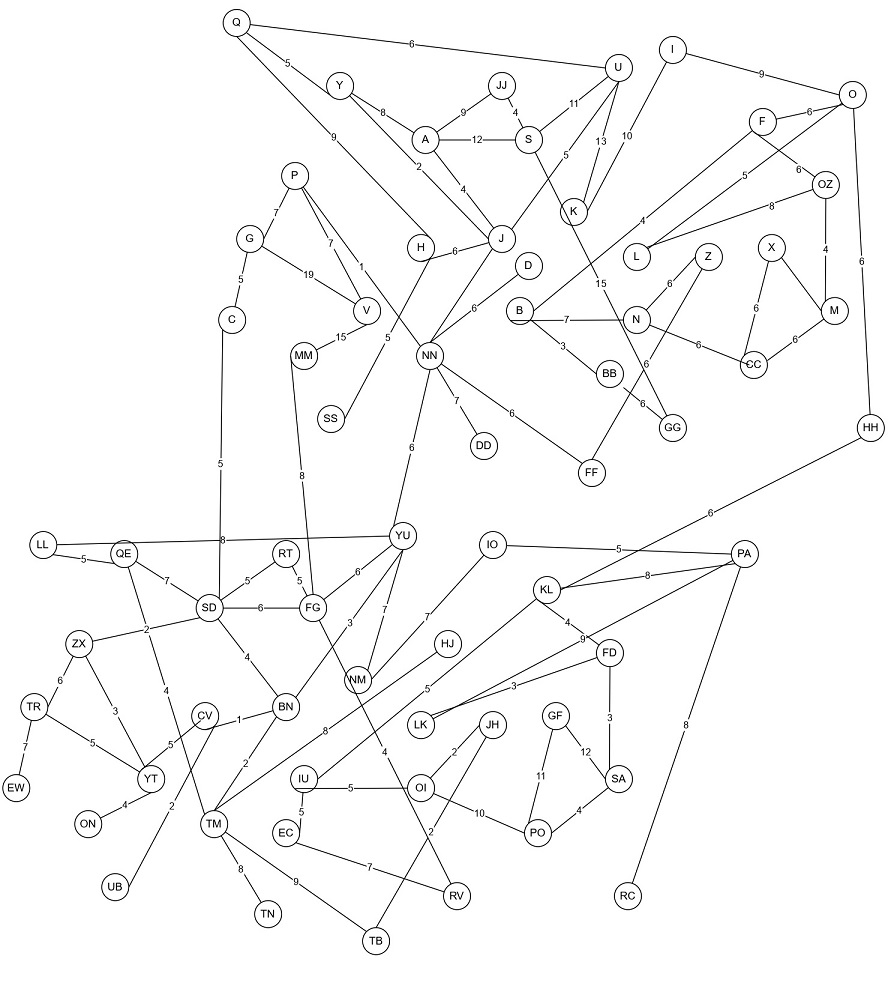

# Estudiante de Ingeniería de Software
# en la Universidad Internacional de las Américas Costa Rica.

<!--START_SECTION:badges-->

<!--END_SECTION:badges-->

## Estructuras Discretas Aplicadas - Javascript 
### [Pagina del proyecto](https://bash20cu.github.io/Universidad/Proyecto_Matatica_Discreta/AlgoritmoDijkstra/)

De un vector dado por el profesor, que representa los vértices de un grafo, y un segundo vector de pares ordenados con peso que representa las aristas, confeccionar una solución programada en cualquier lenguaje de programación que aplique le mejor ruta para navegar de un vértice dado a un segundo vértice dado, escogiendo siempre la cantidad de aristas que sume el menor peso posible. 

El algoritmo genera el camino más corto, desde nodo A hasta nodo B, así sucesivamente, visitando todos los nodos posibles, Comienza sumando su propia distancia, de nodo A = 0, y empieza a buscar aristas y el peso de estas, conectadas entre sí. 

 Ahora como no tenemos el valor de B, entonces lo llamaremos “infinito”, y lo pondremos en una lista, de todos los nodos adyacentes, hasta que sepamos su valor final.  
Ejempló:  nodos por visitar: {0,1,2,3,4,5,6} 
Creando a su vez, otra lista con la distancia hacia ellos 
Ejemplo: distancia : {0:0, 1:2, 2:3, 3:5, 4:15,:5:10,6:15}  

 

En resumen 
Los grafos son usados para modelar conexiones entre objetos, personas o entidades. Tienen dos elementos principales: nodos y arcos. Los nodos representan objetos y los arcos representan las conexiones entre esos objetos.
El algoritmo de Dijkstra encuentra el camino más corto entre un nodo dado (el nodo de origen) y todos los otros nodos del grafo. 

### Descripción del proyecto: 
Se usa utiliza el lenguaje de programación JavaScript (ECMA S6), se auxilia con el framework JQuery en su versión 3.4.1 
La solución está conformada por la siguiente Jerarquía de archivos, basado en Modelo – Vista – Controlador MVC. 

├── grafo.json  
├── index.html  
└── src  
   ├── css  
   │   └── style.css  
   └── js  
       ├── app.js  
       ├── Dijkstra.js  
       ├── jquery-3.4.1.min.js  
       └── Main.js 
 
En la cual se encuentran el archivo index.html, el cual es la maquetación de la aplicación web,  
Seguida de un subnivel, un directorio llamado src ( source ), el cual contiene dos directorios, el primero llamado css, el cual contiene todo el contenido de estilos cascada con un archivo en lenguaje css. El segundo directorio llamado js, que contiene los archivos de controlador en lenguaje JavaScript, estos archivos son: app.js, Dijkstra.js, jquery-3.4.1.min.js 

