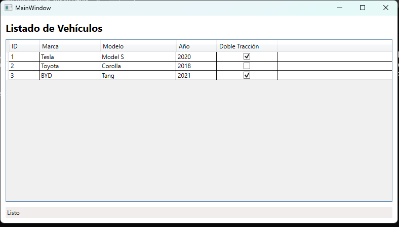
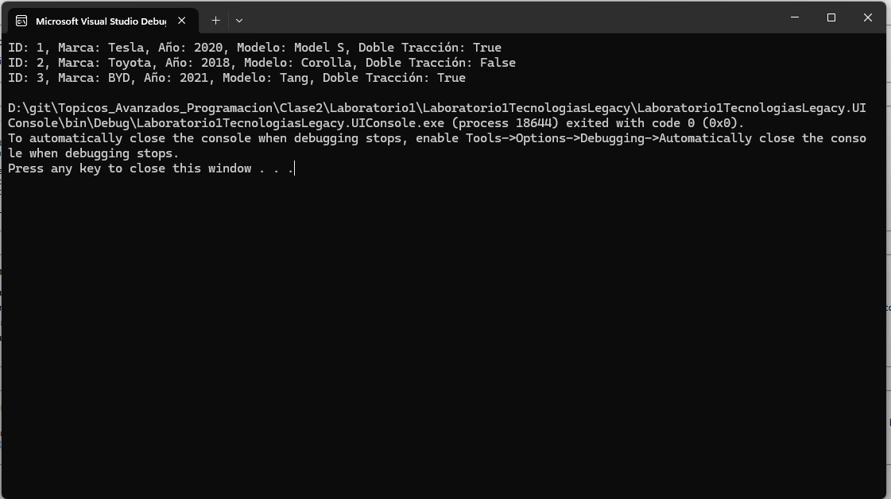
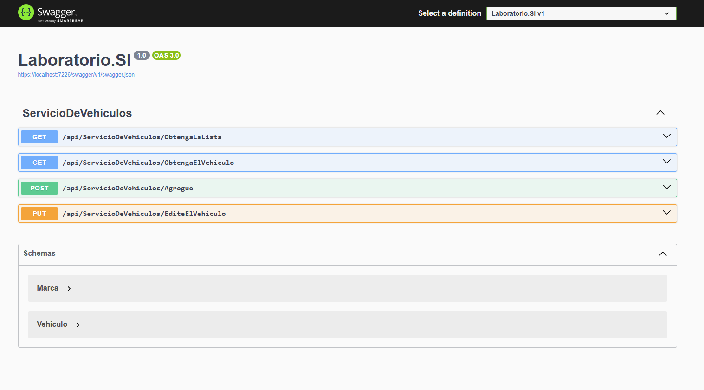
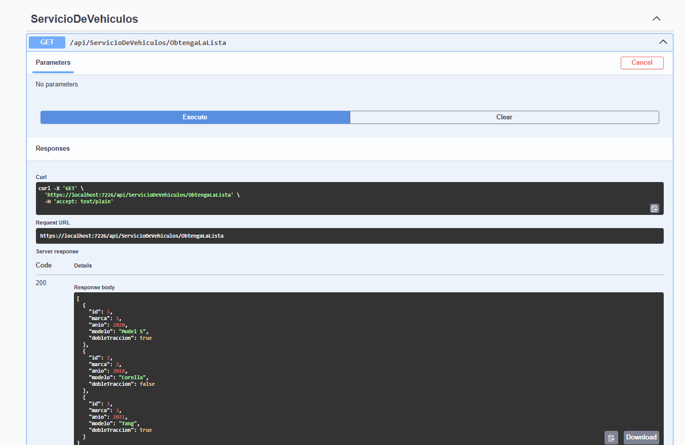

# Estudiante de Ingeniería de Software  

# en la Universidad Internacional de las Américas Costa Rica  

<!--START_SECTION:badges-->

<!--END_SECTION:badges-->

## Laboratorio 2 - Consumo de Servicios Web Legacy (Modelo, WCF, ASMX, UI Consola, RESTFull API, Test(xUNIT)

- Desarrollo de un diseño avanzado con las mejores prácticas vistas en clase sobre clean code  
- Uso de tecnologías legacy  
- Control de versiones con DevOps Azure - Git 
- Desacople de la lógica de negocio con la tecnología de exposición
- Implementación de operaciones CRUD
- Uso de .NET Framework 4.8 y C#
- Implementación de una UI en consola para interactuar con los servicios web
- Implementación de una UI WPF para interactuar con los servicios web
- Implementación de una API REST para interactuar con los servicios web

## INSTRUCCIONES PARA DESARROLLAR EL LABORATORIO:

Usted ha sido contratado para implementar una funcionalidad destinada a una empresa del sector automotriz, la cual desea exponer su inventario de vehículos mediante servicios tecnológicos. La solución es compatible con tecnologías legacy como WCF y Web Services, pero ahora deben migrar a API RESTful.  La implementación debe estar desacoplada de la tecnología de exposición, siguiendo los principios revisados en clase. 

### Tecnologías utilizadas:
- **.NET Framework 4.8**
- **.NET 8 API**
- **C#**
- **Visual Studio 2022**
- **Servicios Web WCF**
- **Servicios Web ASMX**
- **UI Consola**
- **Desacople con RestFull API**

### Estructura de datos del vehículo
Cada vehículo debe contener la siguiente información:

- Marca:
    - 1 = Tesla
    - 2 = Toyota
    - 3 = BYD
- Año: Campo entero
- Modelo: Campo tipo string
- Doble Tracción: Valor booleano (true o false)

### Se deben implementar las operaciones CRUD (Crear, Leer, Actualizar, Eliminar) tanto en WCF como en Web Services:

| Operación | Descripción |
|:-------- |:--------:| 
| C - Create   | Crear un nuevo vehículo   |
| R - Read | Leer/Listar vehículos existentes |
| U - Update | Actualizar información de un vehículo |
| D - Delete | Eliminar un vehículo del inventario |

- 
- 
- 
- 
- 
- 
- 