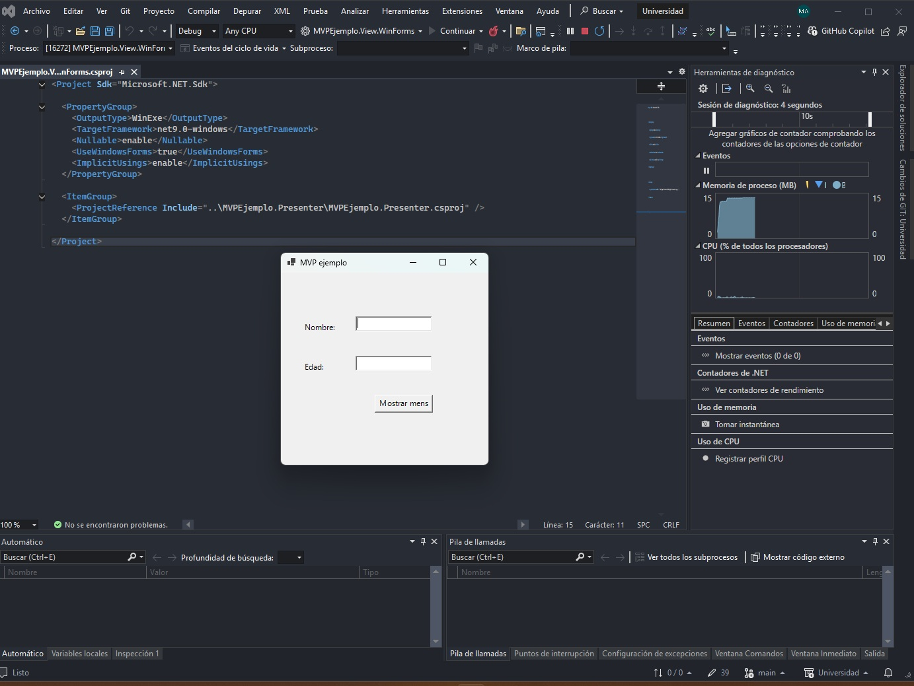
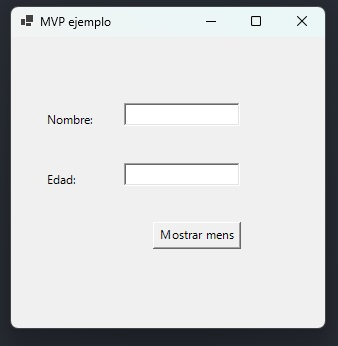

# Estudiante de Ingeniería de Software

# en la Universidad Internacional de las Américas Costa Rica

<!--START_SECTION:badges-->

<!--END_SECTION:badges-->

## Clase 1 -  MVPP con ejemplos de codigo de consola y con interfaz grafica.

- Configuracion de entorno de desarrollo DevOps en Visual Studio 2022 con Azure DevOps. https://azure.microsoft.com/es-es/free/students/?msockid=1fd60d70d44c66be20c01b61d5396717  
- Creacion de repositorio en Azure DevOps y clonacion en Visual Studio 2022.
- Creacion de proyecto de consola en C# .NET 8.0

- 
- 

## 🛠 Tecnologías
 
